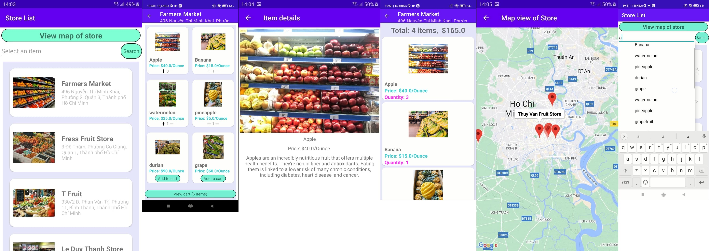
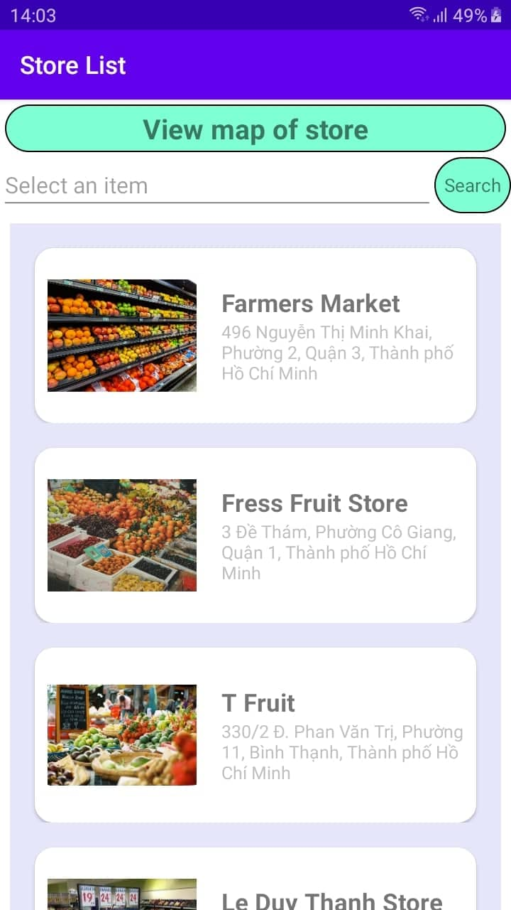
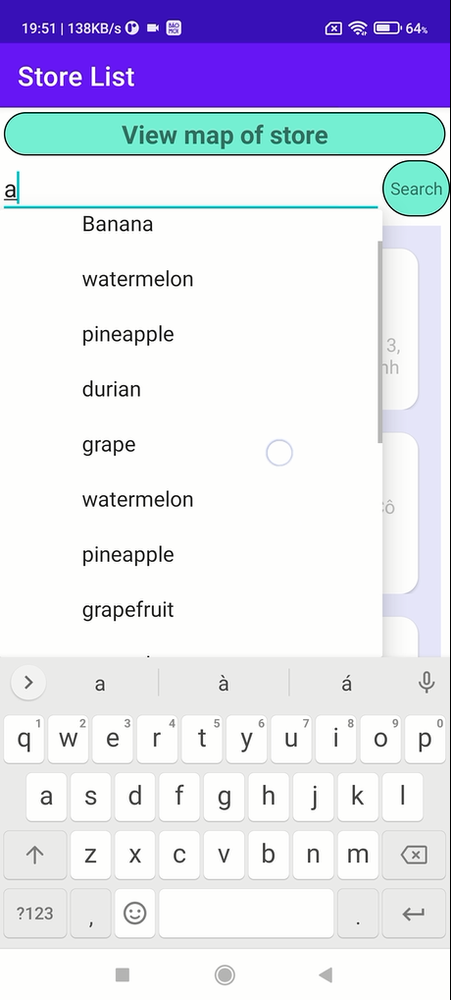
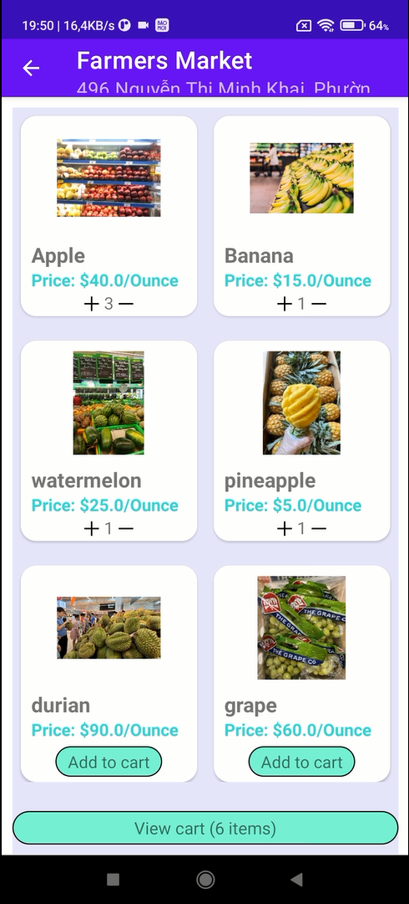
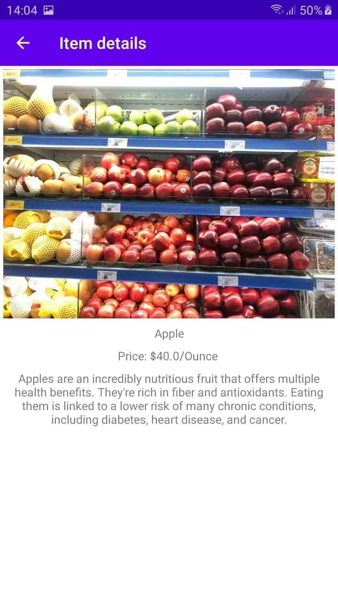
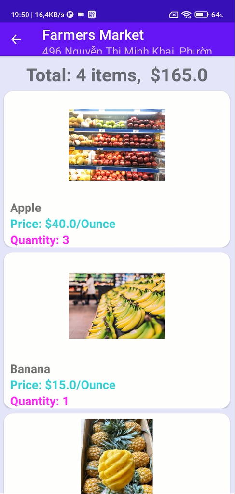

# Java Food/Fruit Android App
Midterm project for Midterm Project
CS426 - Mobile Device Application Development

## Author(s) Group of student in 20CTT2-HCMUS

## App structure and major function
#### This app contain 2 main classes: 
Item: storing information for each fruit (name, price, details, image, url).

StoreModel: contains the information of a store (name, address, position, image url), and its corresponding list of fruits.

#### 1.Main Activity:
- List of stores that available in store.json (RecyclerView)
- Search bar with autocomplete feature
- “View map of store” for viewing and selecting stores in Google Map
We create the storeModelAdapter for custom each row in recyclerView,
By clicking on each row, user can access to the store (listItemsActivity)

#### 2.StoreItemsActivity
The activity displays list of items available in selected store
“Add to cart” buttons on each item
“View cart” button

#### 3.CartItemsActivity
Displaying all items that are added to cart

#### 4.ItemActivity
Displaying detailed description of selected item in the store

#### 5.MapsActivity
Google map with markers that show stores available in the app and allows users to select one of the stores by clicking the corresponding marker.

## App UI

## ScreenShots
### Home Page/ List of stores

### Autocomplete search store by item name

### Map view of stores

### List of items in store

### Item Details Screen & Add To Cart Screen
 &nbsp;&nbsp;&nbsp;&nbsp; 

## Major functions:

#### Displaying and selecting stores and items:
When starting the app, the user will see a splash screen, a list of stores displayed on the screen.
The user can click one of them in order to view a list of items that the store offers.

#### Viewing, adding items to cart:
Users can add items that the store has to the cart by clicking the “Add to cart” button displayed at the bottom of each item, the button will then be replaced by  add and minus button for changing the amount of items.
Users can adjust the quantity of items and choose to view the cart by “View cart” button.
Users can view the detailed description of each item by clicking on them.

#### Viewing stores on Google map:
Beside selecting a store from the list when started, the app has a “View map of store” button displayed on the top, where the user can view all the stores on the map after clicking it.

## Advanced Features

#### View a list of stores
#### Autocomplete search feature:
Show auto-complete suggestion when the user types the name of an item in the search bar by using AutoCompleteTextView which is a subclass of EditText.
The suggestions are shown in a drop down menu in which the user can choose to replace the input text. The drop down menu will be dismissed by either pressing the back button or the enter key.
We set the threshold being 1, which will start showing the suggestions after typing at least 1 character.
After pressing the Search button, the app will return a list of stores that contains the searched item.
To return the original list of stores after searching, click the back button

#### Selecting stores on Google map
The map will display all stores available with Google Map default marker icons, the user can select one of the stores by clicking on the marker, it will take the user to the item lists that the store has, similar to the way of clicking stores list at the beginning of the app.

